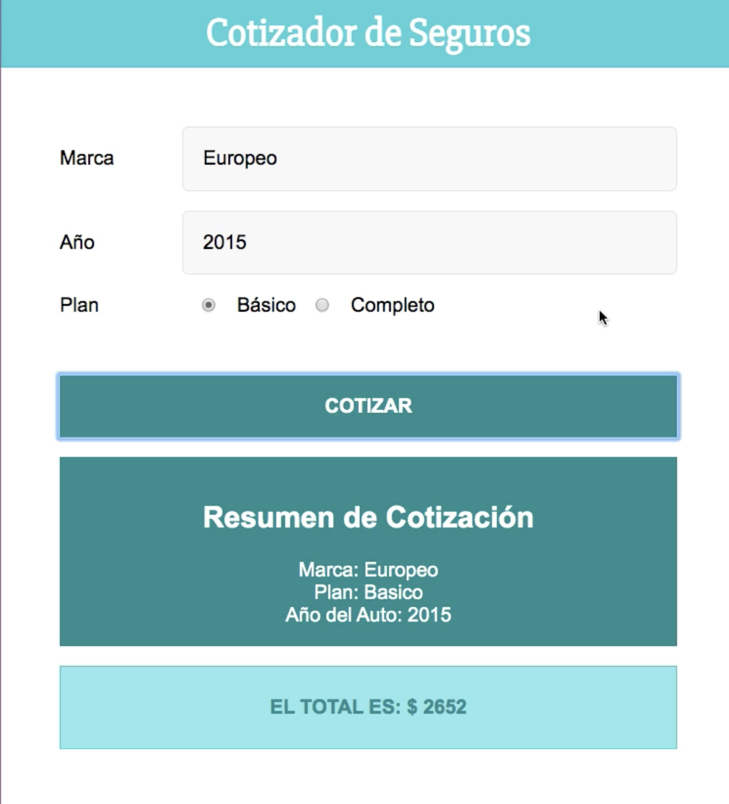

# Budget calculator

## Description
Project with React.js using hooks and style components

## Scripts
In the project directory, you can run:

### `yarn start`

## Technology Stack
- React.js
- Hooks
- Node.js
- Yarn
- Html
- Css
- [Netlify](https://www.netlify.com/)

## Git repo
The url to repository and deployed project:

- [Repository Frontend Link](https://github.com/elenapiaggio/budget-calculator)
- [Deploy Link](https://thebudgetcalculator.netlify.app/)

Made with :heart: by Elena
